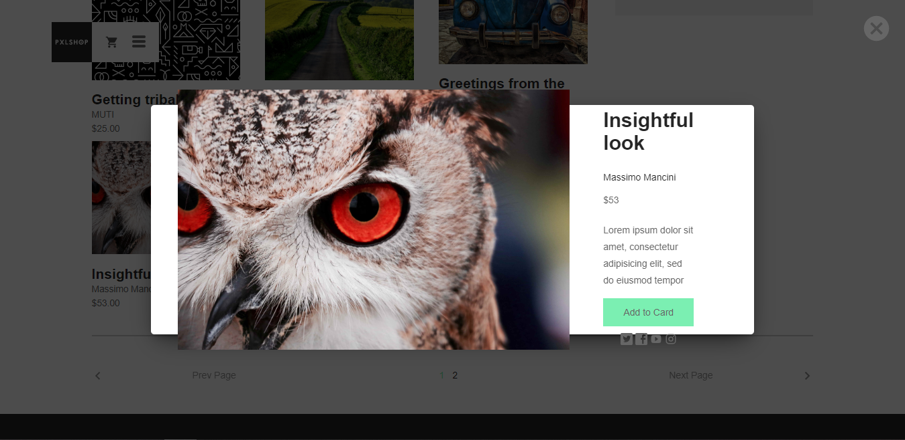
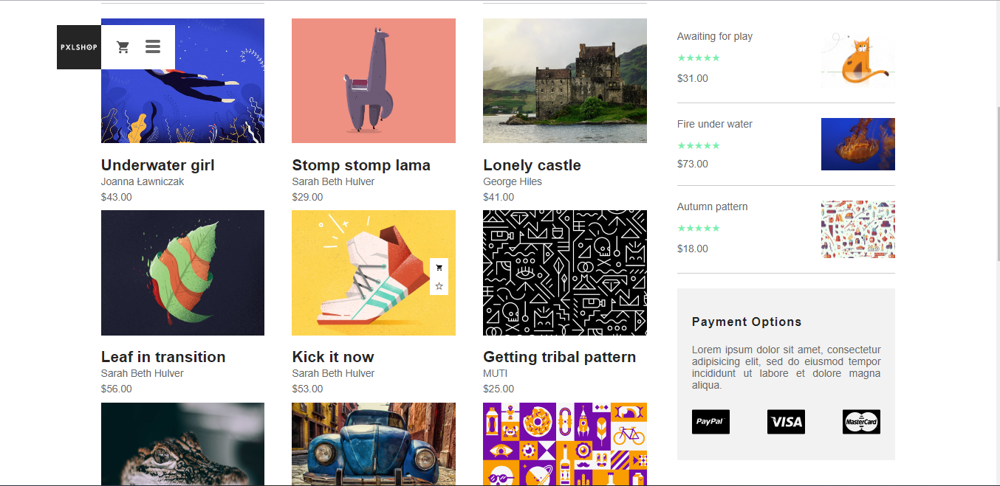

# PXLSHOP

## About

PXLSHOP is ecommerce website made as learning project. :mortar_board:
It uses Vue.js for frontend and Firebase (actually Firebase bindings for Vue.js - VueFire) for backend.
It doesn’t implement the process of paying and transactions.
All illustrations were taken from [dribbble](https://dribbble.com/)

## Technologies

- Vue.js
- Vue-Router
- Webpack
- VueFire
- Firebase
- Pug
- SCSS

## Website

https://pxlshop-21c30.firebaseapp.com/

## Build Setup

``` bash
# install dependencies
npm install

# serve with hot reload at localhost:8080
npm run dev

# build for production with minification
npm run build
```
## Application Screenshots

<a href="https://pxlshop-21c30.firebaseapp.com/" target="_blank">
	
	
	
	
</a>